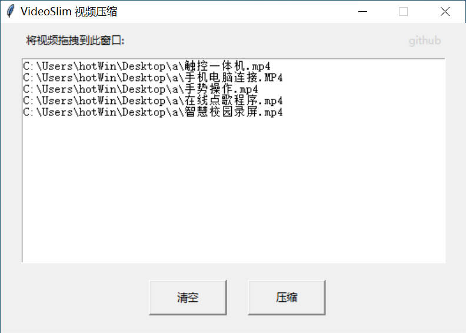
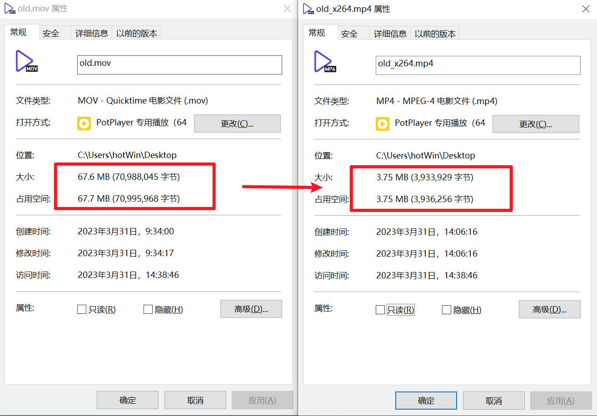

<h1 align="center" style="font-size:50px;font-weight:bold">VideoSlim</h1>
<p align="center">Lossless video compression tool</p>
<p align="center">一款无损的视频压缩工具</p>

<center>
  
</center>

<center>
  
</center>


```bash
感谢小丸工具箱提供参数

"ffmpeg" -i %1 -vn -sn -v 0 -c:a pcm_s16le -f wav pipe: | "neroAacEnc.exe" -ignorelength -lc -br 128000 -if - -of ".\old_atemp.mp4"
VideoSlim 首先使用了 ffmpeg 软件，将 %1 所指代的音频文件（格式未知）转换为 PCM 格式的 WAV 音频，并且将音频流通过管道（pipe）传送给 neroAacEnc 软件，
使用 LC（Low Complexity）模式进行编码，码率为 128kbps，并将输出保存在当前目录下的名为 old_atemp.mp4 的 MP4 文件中。

"x264_32-8bit" --crf 23.5 --preset 8 -I 600 -r 4 -b 3 --me umh -i 1 --scenecut 60 -f 1:1 --qcomp 0.5 --psy-rd 0.3:0 --aq-mode 2 --aq-strength 0.8 -o ".\old_vtemp.mp4" %1
这个命令使用了 x264 软件，将 %1 所指代的视频文件（格式未知）编码为 H.264 格式的视频，并且将输出保存在当前目录下的名为 old_vtemp.mp4 的 MP4 文件中。具体的编码参数如下：

--crf 23.5：设置压缩质量，数值越小，质量越好，取值范围为 0~51。
--preset 8：设置编码速度和质量的平衡，数值越小，速度越快，质量越差，取值范围为 0~9。
-I 600：设置 I 帧间隔为 600 帧。
-r 4：设置帧率为 4 帧/秒。
-b 3：设置比特率为 3Mbps。
--me umh：设置运动估计算法为 UMH（Uneven Multi-Hexagon）。
-i 1：设置最小编码单元大小为 1。
--scenecut 60：设置场景切换检测的阈值为 60。
-f 1:1：设置像素格式为 4:4:4。
--qcomp 0.5：设置量化器比例因子为 0.5。
--psy-rd 0.3:0：设置视觉优化参数，第一个数值为 RD（Rate-Distortion）优化量，第二个数值为不使用 PSY（Perceptual Subband Filtering）优化。
--aq-mode 2：开启自适应量化器模式，使用 AQ（Adaptive Quantization）算法
--aq-strength 0.8：设置 AQ 算法的强度为 0.8。

"mp4box" -add ".\old_vtemp.mp4#trackID=1:name=" -add ".\old_atemp.mp4#trackID=1:name=" -new %2
这个命令使用了 MP4Box 软件，将第一步和第二步生成的两个 MP4 文件合并成一个 MP4 文件，并且将输出保存为 %2 所指代的文件名。
其中，old_vtemp.mp4 是视频文件，old_atemp.mp4 是音频文件，两者都被添加到了输出文件中，每个媒体流都被赋予了唯一的 trackID 和名称。
```


