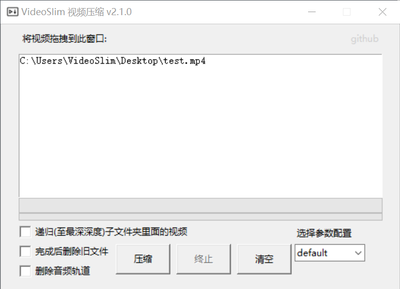
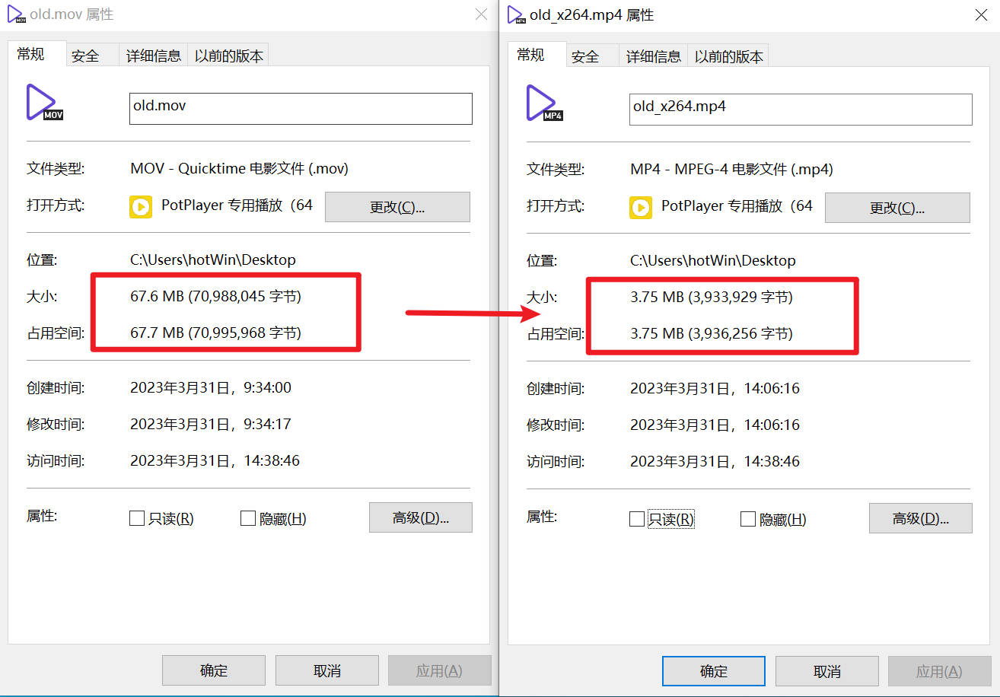
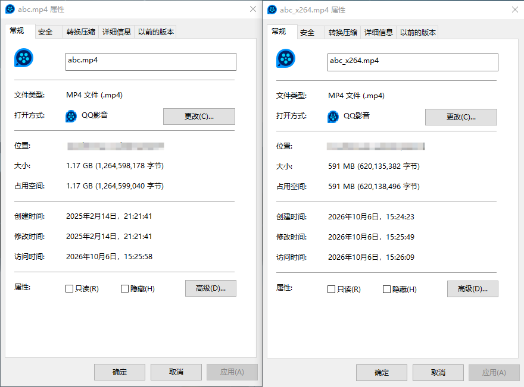
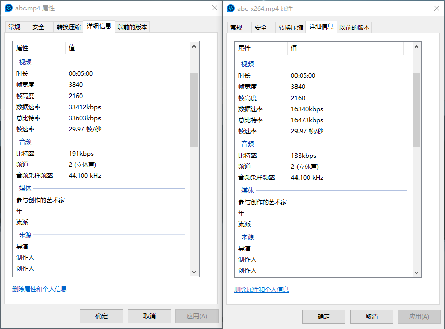

<h1 align="center" style="font-size:50px;font-weight:bold">VideoSlim</h1>
<p align="center">简洁易用的 Windows 视频压缩工具</p>

<p align="center">
  
  <br/>
  
  <br/>
  <a href="https://github.com/DongGuoZheng/VideoSlim">GitHub</a>
  ·
  <a href="#快速使用">快速使用</a>
  ·
  <a href="#配置">配置</a>
  ·
  <a href="#构建指南">构建指南</a>
</p>

---

> [!WARNING]
> 以下内容有不少 AI 生成，所以如果发现 REAME.md 写错了也正常。
> 
> 欢迎为项目提供 PR ！

## 功能特性
- **一键压缩**: 拖拽文件/文件夹到窗口，选择配置即可开始压缩
- **智能处理**: 自动修正视频旋转元数据，优化输出质量
- **字幕保留**: 压缩后保留原视频的字幕轨道（直接复制，不重新编码）
- **多配置方案**: 内置默认的 `default` 配置与用于快速压缩的`fast`配置，支持自定义扩展
- **自动选择硬件加速**: 内置的两套配置均可以自动选择硬件加速，软件会自动探测并使用当前机器上可用的硬件编码器（`h264_nvenc` → `h264_qsv` → `h264_amf`），均不可用时回退到 `libx264` 软件编码；因此同一份默认配置在不同主机上都能自动获得硬件加速。极大提升了压缩效率
- **批量处理**: 支持递归扫描子文件夹，批量处理多个视频文件
- **高级选项**:
  - 可选择删除音频轨道以进一步减小文件体积
  - 支持压缩完成后自动删除源文件
  - 可选OpenCL GPU加速，提升编码速度
- **日志记录**: 详细的操作日志，便于调试和问题排查
- **绿色便携**: 单文件可执行程序，无需安装，包含所有必要依赖

## 效率实测

测试环境：R7-5800H；Windows10系统；16G ddr4内存；RTX3060Laptop。

使用fast_nvidia配置压缩时长为5分钟的4k视频，用时约1分30秒，CPU平均占用为10%，GPU视频编码核心满载，视频解码核心平均占用为50%，3D核心平均占用为70%。GPU温度为55℃左右，笔记本风扇噪音不高，可以连续进行大量视频压缩工作。





## 技术栈
- **Python 3.12+**: 主要开发语言
- **Tkinter**: 图形用户界面
- **FFmpeg**: 视频处理核心工具（已内置）
- **x264**: H.264 视频编码器（通过FFmpeg调用）
- **AAC**: 高级音频编码支持
- **pymediainfo**: 专业媒体信息解析库
- **windnd**: 实现拖拽功能
- **PyInstaller**: 应用程序打包工具

## 快速使用
**下载可执行文件**: 从发布页面下载 `VideoSlim.exe`（已包含所有依赖）


### 使用步骤
1. 将视频文件或包含视频的文件夹拖入窗口
2. 从下拉菜单选择合适的配置方案
3. 根据需要勾选高级选项：
   - ✅ 递归：同时处理子文件夹中的视频
   - ✅ 删除源文件：压缩完成后删除原始视频
   - ✅ 删除音频：移除视频中的音频轨道
4. 点击"压缩"按钮开始处理
5. 如中途需要停止，点击"终止"按钮（压缩进行中才会可用）；终止后当前 ffmpeg 进程会立即结束。

**输出结果**: 处理完成后，将在源文件同目录生成 `*_x264.mp4` 文件。

## 配置
应用启动时读取 `config.json`。若不存在，将自动生成默认配置（包含 `default` 与 `fast` 配置）


### 参数说明

#### 视频编码参数

| 参数名                  | 取值范围       | 默认值 | 说明                                                                                                                                                                                                                                                                                   |
| ----------------------- | -------------- | ------ | -------------------------------------------------------------------------------------------------------------------------------------------------------------------------------------------------------------------------------------------------------------------------------------- |
| **crf**                 | 0–51           | 23.5   | 质量控制参数，值越小质量越高（体积越大）<br>推荐范围：18–28                                                                                                                                                                                                                            |
| **preset**              | 编码预设字符串 | slower | 编码速度/压缩效率平衡<br>可选值：ultrafast, superfast, veryfast, faster, fast, medium, slow, slower, veryslow                                                                                                                                                                          |
| **I**                   | 正整数         | 600    | 关键帧间隔（GOP），控制视频的时间结构                                                                                                                                                                                                                                                  |
| **r**                   | 正整数         | 4      | 参考帧数量，影响压缩效率和编码速度                                                                                                                                                                                                                                                     |
| **b**                   | 正整数         | 3      | B 帧数量，提升压缩效率但增加编码复杂度                                                                                                                                                                                                                                                 |
| **opencl_acceleration** | true/false     | false  | 是否开启 x264 的 OpenCL lookahead 加速<br>需 ffmpeg 构建支持 OpenCL，不支持时自动忽略并回退到软件编码（本项目自带 ffmpeg **未编译 OpenCL**）                                                                                                                                           |
| **hwaccel**             | 编码预设字符串 | auto   | 可选：none/auto/d3d11va/dxva2/cuda/qsv/vaapi<br>硬件解码方式，作用于输入文件<br>`none` 表示不启用；解码不可用时 ffmpeg 自动回退到软件解码                                                                                                                                              |
| **encoder**             | 编码预设字符串 | auto   | 可选：auto/libx264/h264_nvenc/h264_qsv/h264_amf/h264_mf<br>视频编码器<br>`auto` 会按 `h264_nvenc` → `h264_qsv` → `h264_amf` 顺序自动选择**可用的硬件编码器**，均不可用时回退 `libx264`；`libx264` 为软件编码<br>`h264_mf` 依赖系统 MFT，可能落到微软软件编码器，不建议作为通用加速方案 |
| **fallback_to_cpu**     | true/false     | true   | 当指定的硬件编码器不可用时，是否自动回退到 `libx264` 软件编码                                                                                                                                                                                                                          |

#### 配置建议
- **日常使用**: 推荐使用 "default" 配置（crf=23.5, preset=slower），会自动使用可用的硬件编码器；若机器无可用硬件编码器则回退软件编码
- **快速处理**: 使用"fast"配置，此配置crf值更大且编码速度字符串设定为"fast"，适合大量视频的快速压缩：
- **自定义配置**: 可在 `configs` 中添加新的配置方案，命名任意；`encoder` 填 `auto` 可自动适配

## 构建指南

### 环境准备
1. **安装 Python**: 确保安装了 Python 3.12 或更高版本
2. **克隆项目并进入项目根目录**: 
   ```bash
   git clone https://github.com/DongGuoZheng/VideoSlim.git
   cd VideoSlim
   ```
2.5 **安装 uv**: 
   ```bash
   pipx install uv
   ```
3. **创建虚拟环境并安装依赖**: 
   ```bash
   uv venv
   uv sync --extra dev
   ```
4. **安装构建工具**: 
   ```bash
   uv pip install pyinstaller
   ```

### 构建
项目提供了 `scripts/build.cmd` 自动化构建脚本，可一键生成单文件可执行程序：

```bash
# 在项目根目录运行
scripts/build.cmd

# 或者用 uv 运行
uv run scripts/build.cmd
```

构建过程会自动完成以下操作：
- 清理旧的构建文件
- 配置 PyInstaller 打包参数
- 添加必要的工具文件（ffmpeg.exe、icon.ico）
- 生成单文件可执行程序

构建完成后，可执行文件将位于：`output/dist/VideoSlim.exe`

## 开发指南

### 代码格式化
项目使用 [ruff](https://github.com/astral-sh/ruff) 作为代码格式化器，遵循默认的格式化规则。

#### 格式化代码
```bash
uv run ruff format
```

#### 检查代码格式
```bash
uv run ruff check
```

### 开发工作流
1. 创建并激活虚拟环境
2. 安装依赖（包括开发依赖）
3. 编写代码
4. 使用 ruff 格式化代码
5. 测试功能
6. 提交代码


## 目录结构
```
VideoSlim/
├── main.py                # 应用程序启动入口
├── config.json            # 配置文件（首次运行自动生成）
├── pyproject.toml         # Python 项目配置
├── README.md              # 项目文档
├── LICENSE                # 许可证文件
├── src/                   # 源代码主目录
│   ├── controller.py      # MVC 控制器层
│   ├── view.py            # MVC 视图层
│   ├── meta.py            # 应用常量和版本定义
│   ├── service/           # 核心服务模块
│   │   ├── video.py       # 视频压缩处理服务
│   │   ├── config.py      # 配置管理服务
│   │   ├── message.py     # 消息通信服务
│   │   └── updater.py     # 更新检查服务
│   ├── model/             # 数据模型定义
│   └── utils/             # 工具函数库
├── tools/                 # 内置工具集
│   ├── ffmpeg.exe         # FFmpeg 视频处理引擎
│   ├── icon.ico           # 应用程序图标
│   └── LICENSE            # 第三方工具许可证
├── img/                   # 文档截图和资源
├── scripts/               # 辅助脚本
│   └── build.cmd          # 自动化构建脚本
└── output/                # 构建输出目录
```

## 工作原理

### 核心处理流程

```
[输入视频] → [媒体信息解析] → [旋转修正（可选）] → [视频编码] → [音频处理] → [字幕处理] → [输出文件]
```

1. **媒体信息解析**
   - 使用 pymediainfo 库分析视频文件的详细信息
   - 检测视频编码、分辨率、帧率、时长等参数
   - 判断是否包含音频轨道和旋转元数据

2. **旋转修正预处理**
   - 检测视频的旋转元数据（如手机拍摄的视频）
   - 如果需要，使用 FFmpeg 进行旋转修正，生成临时文件

3. **视频编码压缩**
   - 默认 `encoder: "auto"`：按 `h264_nvenc` → `h264_qsv` → `h264_amf` 顺序自动选择当前机器可用的
     **硬件编码器**实现 GPU 加速，配合 `hwaccel` 硬件解码；均不可用时回退 `libx264` 软件编码
   - 也可显式指定编码器（`libx264`/`h264_nvenc`/`h264_qsv`/`h264_amf`/`h264_mf`）；
     显式的硬件编码器不可用时会按 `fallback_to_cpu` 自动回退，不会导致压缩失败
   - 可选 `opencl_acceleration`（x264 OpenCL lookahead），但需 ffmpeg 构建支持；本项目自带的 ffmpeg 未编译 OpenCL，
     启用后会自动忽略并回退；真正的 GPU 加速请使用 `encoder` 硬件编码器

4. **音频处理**
   - 根据用户选择保留或删除音频轨道
   - 保留时使用 AAC 编码，确保音频质量

5. **字幕处理**
   - 自动保留原视频中的字幕轨道，直接复制而不重新编码
   - 若字幕与输出容器不兼容（写入文件头时即失败），会自动回退为不保留字幕，
     确保压缩本身不会因此失败

6. **输出文件**
   - 生成与源文件同格式的压缩视频（如 `*_x264.mp4`、`*_x264.mkv`）
   - 文件名格式：`原始文件名_x264.扩展名`
   - 自动清理临时文件

### 技术实现亮点
- **单命令处理**: 使用单个 FFmpeg 命令完成所有处理，减少文件 I/O 开销
- **智能路径处理**: 自动适配开发和打包环境的工具路径
- **异常处理**: 完善的错误捕获和日志记录，确保程序稳定性
- **性能优化**: 合理的线程管理和资源利用

## 日志与调试
- 程序每次启动都会在 `log` 文件夹下生成一个以启动时间戳命名的日志文件（如 `log/2026-10-06_18-28-26.log`）
- 日志包含详细的命令执行信息和错误信息
- 如遇到问题，可查看 `log` 文件夹中最新的日志文件进行调试

## 常见问题
- **无法拖拽/窗口不响应**: 确认已安装所有依赖，并以常规权限运行
- **无法解析媒体信息**: 确保视频文件未被占用，或尝试安装最新版本的 MediaInfo
- **拖入后提示 "没有找到可处理的视频文件"**: 多为文件名含特殊字符（如 emoji）时被系统代码页破坏所致，
  已改用 Unicode 拖拽接口修复；若仍出现，请查看 `log` 文件夹中最新的日志文件，其中会记录被略过的路径及原因
- **编码失败**: 查看 `log` 文件夹中最新的日志文件获取具体错误信息
- **质量不满意**: 调整 `crf` 参数（值越小质量越高）
- **编码过慢**: 提高 `preset` 参数值（如从 slow 改为 medium 或 fast）
- **开启 `opencl_acceleration` 后没有加速**: 本项目自带的 `tools/ffmpeg.exe` **未编译 OpenCL 支持**
  （可执行 `tools\ffmpeg.exe -buildconf | findstr opencl` 验证为空），因此 `opencl_acceleration` 会被自动忽略，
  程序回退到软件编码（日志中会有警告）。**想要真正的 GPU 加速，请使用硬件编码器**：默认的 `"encoder": "auto"`
  会自动选择当前机器可用的硬件编码器；也可显式指定 `h264_nvenc`（NVIDIA）/`h264_qsv`（Intel）/`h264_amf`（AMD），
  并可同时设置 `"hwaccel": "auto"` 启用硬件解码。
- **如何确认是否在用 GPU 编码**: 查看日志中的 `自动选择硬件编码器: h264_nvenc` 或 `使用视频编码器: h264_nvenc` 记录，
  或用任务管理器观察 GPU 占用。

## 许可证
本项目采用开源许可证，详见 `LICENSE` 文件。
FFmpeg 和其他第三方工具按其各自许可证使用与分发。

## 致谢
- **FFmpeg**: 强大的音视频处理工具

—— 祝使用愉快 🎬

## Star History

